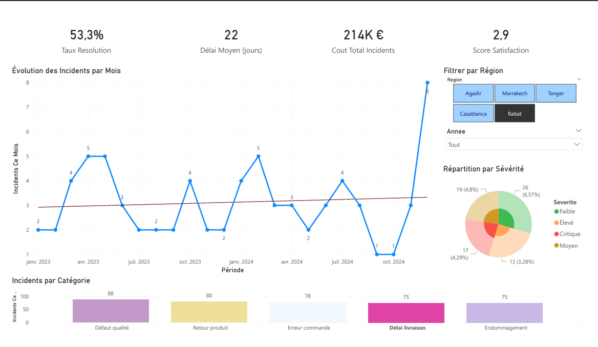
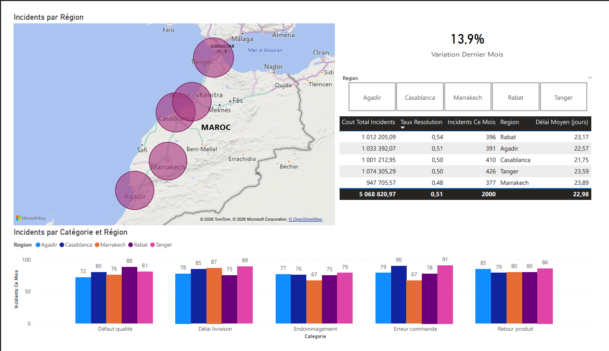
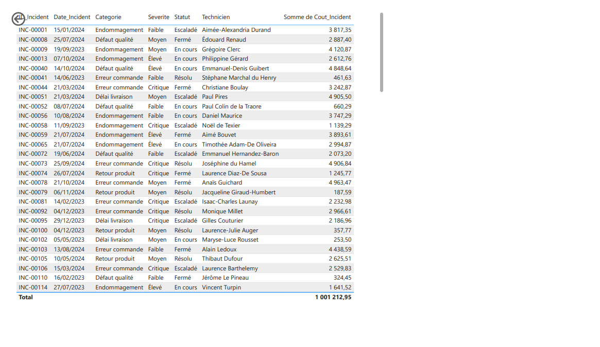
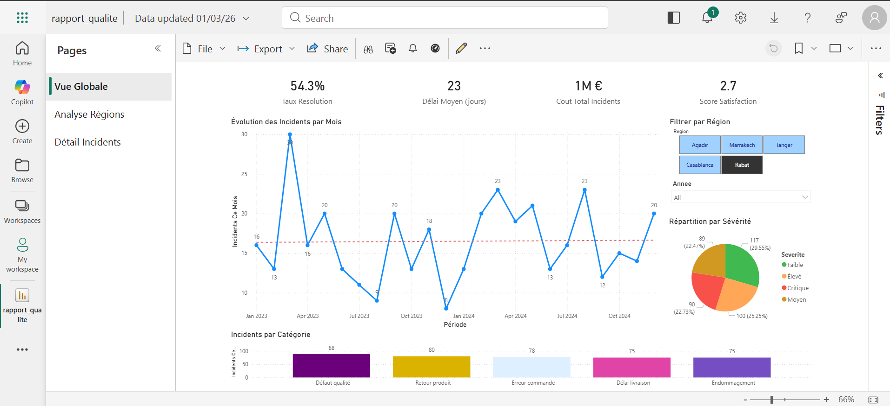

# 📊 Power BI Portfolio — Quality Incidents Analytics

[](https://github.com/MaryemElyazghi/powerbi-portfolio/actions/workflows/validate-pipeline.yml)


End-to-end **quality reporting solution** built with Power BI Service, Python ETL,
automated CI/CD and DAX analytics. Covers data ingestion, transformation, modeling,
interactive dashboards, RLS security and scheduled refresh.

---

## 🗂️ Projects

| # | Project | Stack | Key Result |
|---|---------|-------|------------|
| 01 | [Quality Incidents Dashboard](./01-reporting-qualite/) | Power BI Service · Python · SQL · VBA | 94% time reduction on reporting consolidation |
| 02 | Customer RFM Segmentation | Power BI · Python · PostgreSQL | 3x ROI on retention campaigns |
| 03 | COVID Analytics Pipeline | Azure Data Factory · Databricks · Power BI | <2min latency, 80% less manual work |

---

## ⚙️ Technical Stack

### Power BI Service — Production Deployment
- ✅ Workspace publishing with shared access
- ✅ Row-Level Security (RLS) by region
- ✅ Scheduled incremental refresh (daily at 08:00)
- ✅ PBIX version control via Git

### DAX — Advanced Measures
- `CALCULATE` + `DATESINPERIOD` — rolling time-intelligence
- `RANKX` — performance ranking
- `VAR / RETURN` — complex business logic
- `DIVIDE` + `AVERAGEX` — quality KPIs
- `PREVIOUSMONTH` — Month-over-Month variation

### ETL & Automation
- Python (Pandas) — data extraction and transformation
- Excel VBA — legacy source consolidation
- Apache Airflow — pipeline orchestration
- GitHub Actions — CI/CD with automated data quality tests

### Data Quality
- 6 automated pytest tests on every push
- Schema validation, null checks, duplicate detection
- Range validation on numeric fields

---

## 📊 Dashboard Pages

### Page 1 — Global Quality Overview
4 KPI cards · Trend line · Category breakdown · Severity pie chart · Dynamic slicers

### Page 2 — Regional Analysis
Geographic map · Cross-filtered table · Grouped bar chart by region · MoM variation

### Page 3 — Drill-Through Detail
Full incident log · Technician ranking (RANKX) · Back navigation button

---

## 📸 Screenshots






---

## 🚀 Quick Start

```bash
git clone https://github.com/MaryemElyazghi/powerbi-portfolio.git
cd powerbi-portfolio
pip install -r requirements.txt
python data/generate_quality_data.py
pytest tests/ -v
```

Open `01-reporting-qualite/rapport_qualite.pbix` in Power BI Desktop.

---

## 📁 Repository Structure

```
powerbi-portfolio/
├── 01-reporting-qualite/
│   ├── rapport_qualite.pbix
│   ├── dax-measures.md
│   ├── deployment-steps.md
│   └── screenshots/
├── data/
│   ├── generate_quality_data.py
│   └── incidents_qualite.csv
├── tests/
│   └── test_data_quality.py
├── .github/workflows/
│   └── validate-pipeline.yml
└── README.md
```

---

*Data Analytics · Power BI Service · Python ETL · CI/CD*
